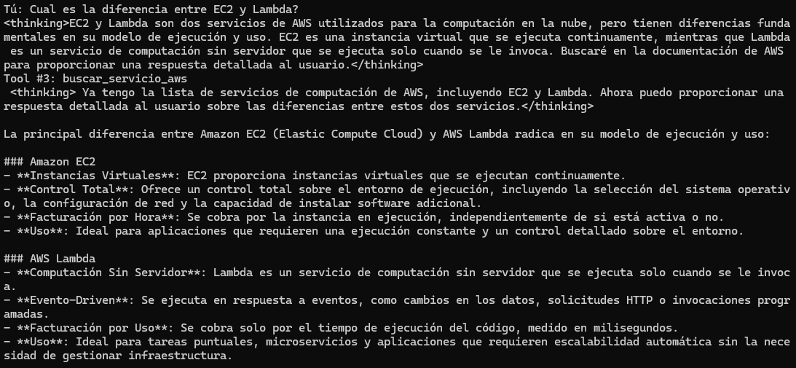
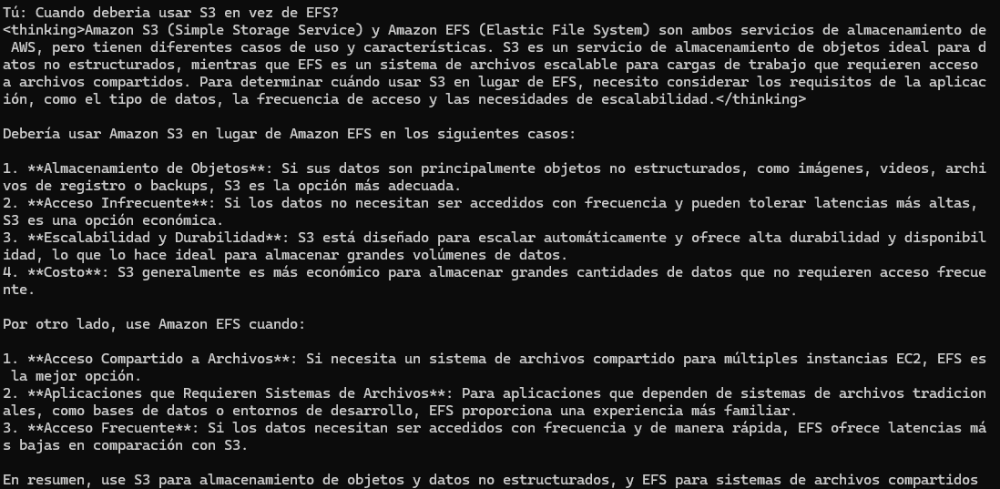

# AWS Expert Agent 🤖

Agente conversacional especializado en AWS, construido con [Strands Agents](https://strandsagents.com) y Amazon Bedrock. Responde preguntas sobre costos, arquitecturas y servicios de AWS usando herramientas personalizadas.

## Herramientas disponibles

El agente cuenta con 3 herramientas personalizadas definidas en `tools.py`:

| Herramienta | Descripción |
|---|---|
| `estimar_costo_lambda` | Calcula el costo mensual estimado de AWS Lambda dado el número de invocaciones, duración y memoria |
| `recomendar_arquitectura` | Devuelve una arquitectura AWS recomendada según el caso de uso (`api_rest`, `streaming`, `ml_inference`, `static_web`, `batch`) |
| `buscar_servicio_aws` | Lista los principales servicios AWS de una categoría (`compute`, `storage`, `database`, `ai`, `networking`) |

## Requisitos

- Python 3.10+
- Credenciales de AWS con acceso a Amazon Bedrock (modelo `us.amazon.nova-pro-v1:0` por defecto)

## Instalación

```bash
# Clonar el repositorio
git clone <url-del-repo>
cd <nombre-del-repo>

# Crear entorno virtual (recomendado)
python -m venv .venv
source .venv/bin/activate  # Windows: .venv\Scripts\activate

# Instalar dependencias
pip install -r requirements.txt
```

## Dependencias

```
strands-agents       # Framework principal del agente
strands-agents-tools # Herramientas adicionales de Strands
python-dotenv        # Carga de variables de entorno desde .env
```

## Configuración

Copia `.env.example` a `.env` y completa tus credenciales de AWS:

```bash
cp .env.example .env
```

## Uso

```bash
python agent.py
```

El agente inicia un loop interactivo en la terminal. Escribe `salir` para terminar.

### Ejemplos de preguntas

```
¿Cuánto cuesta Lambda con 5 millones de invocaciones, 300ms y 256MB?
Recomiéndame una arquitectura para una API REST serverless
¿Qué servicios de cómputo tiene AWS?
```

## Evidencias

El agente respondiendo 3 preguntas distintas en la terminal de Kiro:

.png)



## Estructura del proyecto

```
.
├── agent.py          # Agente principal con system prompt y herramientas integradas
├── tools.py          # 3 herramientas personalizadas con @tool
├── requirements.txt  # Dependencias del proyecto
├── test_agent.py     # Pruebas unitarias con pytest
├── .env.example      # Variables de entorno de ejemplo
├── evidencia1 (1).png
├── evidencia2.png
└── evidencia3.png
```
